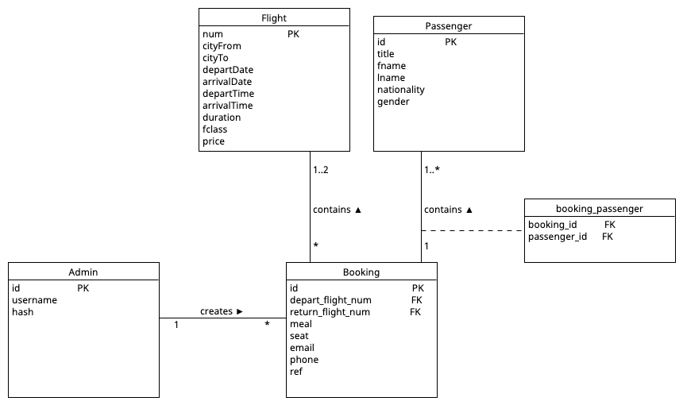

# Functionality 

Admins login to admin panel and create flights.

Users are able to search and book these flight(s) on the homepage. They can choose one way or round trip.
Users are able to make some selections during booking process (meal choice, seat choice, etc.)
Passenger(s) and booking details are stored.

Users are able to manage their booking with a booking id and ref number.

# Local Set Up

1. Download/clone the repo

2. Create virtual environment:
   ```python
   python3 -m venv venv #macOS/Linux
   ```
   ```python
   python -m venv venv # Windows
   ```

3. Activate it:
   ```python
   source venv/bin/activate # macOS/Linux
   ```
   ```python
   venv\Scripts\activate # Windows
   ```

4. Install dependencies:
   ```python
   pip install -r requirements.txt
   ```

5. Create database
   ```python
   python3 create_db.py # macOS/Linux
   ```
   ```python
   python create_db.py # windows
   ```

6. Run the app:
    ```python
   flask run
   ```

# Database
SQLite is used locally. When deploying, DATABASE_URL (and SECRET_KEY) environment variable should be created.



